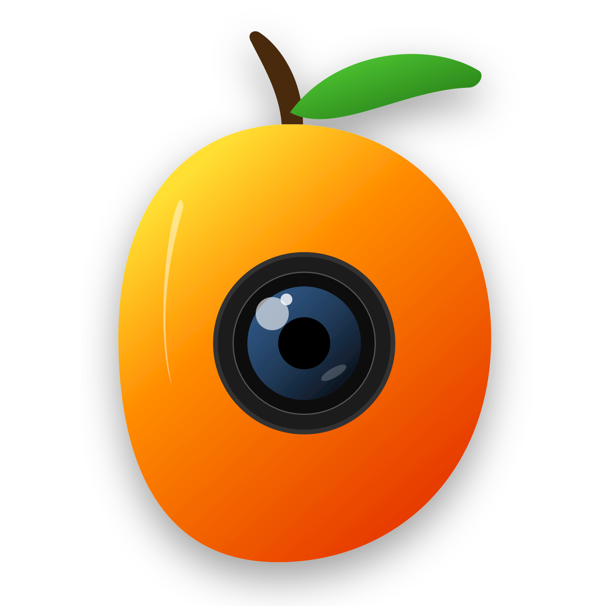

<h2 align="center"><u>Mango Cam</u></h2>

Mango Cam działa tylko na systemie linux
<h4 align="center"> Mango Cam działa tylko na systemie linux </h4>

    
    
    
 
    
    
    

### [+] Description
Mango Cam jest to rozwiazanie do popularnych aplikacji jak DroidCam itp. ale dla linux, Jak narazie działa na systemie Android który posiada ADB. 

### [+] Installation
 - `sudo chmod +x mangocam.sh`
 - `bash mangocam.sh`

### [+] Usage
`./mangocam.sh`

### [+] Requirements
 - Android Device
 - ADB
 - Developer Options: ON

